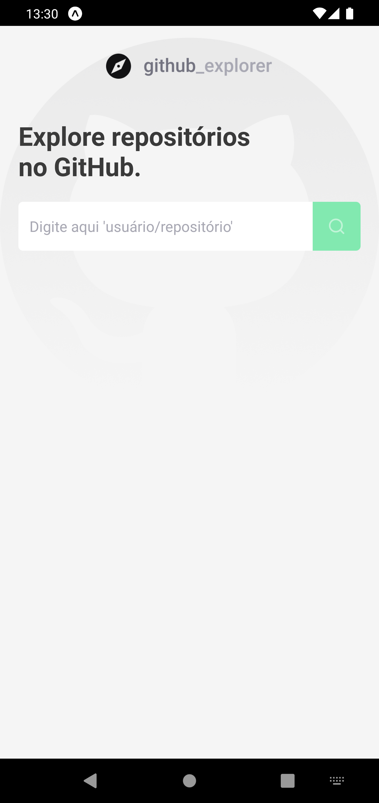
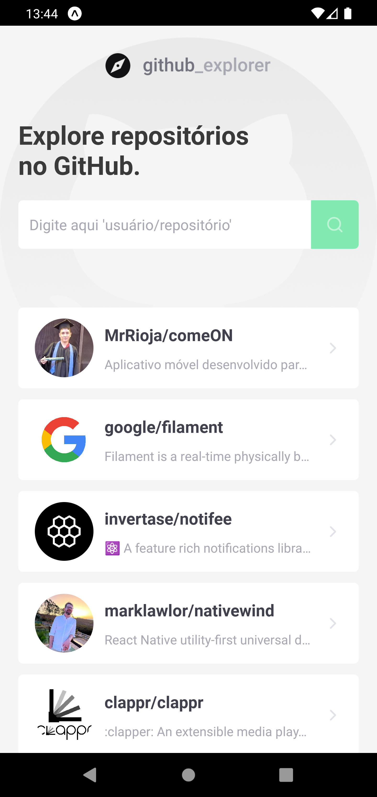
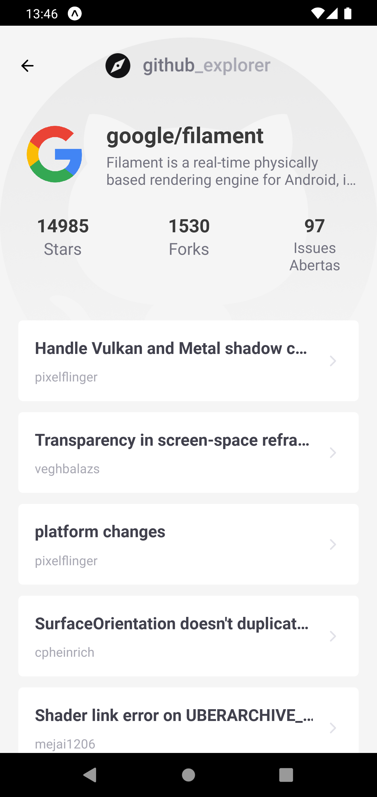
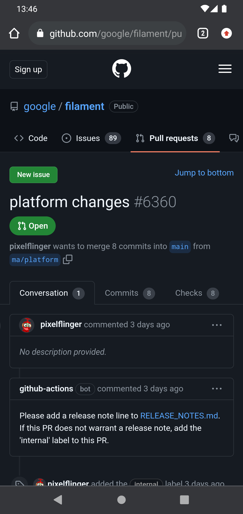

<p align="center">
  
  <br>
</p>
<h3 align="center">
  Do Github para a palma da sua mão!
</h3>

<p align="center">
  
  
  
  
</p>
<br>

<p align="center">
  <a href="#sobre">Sobre</a> •
  <a href="#github-explorer">Github Explorer</a> •
  <a href="#instalação">Instalação</a> •
  <a href="#tecnologias">Tecnologias</a> •
  <a href="#autor">Autor</a>  
</p>

## Sobre

Projeto desenvolvido durante o bootcamp Ignite da RocketSeat na trilha de React Native cujo objetivo foi colocar em prática os ensinamentos do curso e consolidar as habilidades de construção de aplicativos móveis.

## Github Explorer

O Github Explorer tem como objetivo deixar repositórios do interesse dos usuários altamente acessíveis para facilitar a visualização de seus números e os PRs abertos.

Ao acessar o app, o usuário irá se deparar com a tela abaixo, aonde estará contida a lista de repositórios adicionados por ele e um campo de busca para a adição de novos repositórios:



Após adicionar repos de interesse, o usuário terá a seguinte visualização:



Cada projeto adicionado é um card clicável contendo informações do proprietário e do repo e, quando clicado, direcionará para a tela abaixo aonde mais detalhes serão exibidos:



Além dos números atuais do projeto, teremos uma listagem de cards clicáveis contendo os PRs abertos. Ao clicar no PR de interesse para acompanhar as discussões e prováveis mudanças, o usuário será direcionado para os detalhes do PR no Github, conforme exemplificado a seguir:



Em resumo, são essas as funcionalidades da aplicação. App muito objetivo para atender o objetivo proposto e para ilustrar tamanha objetividade, deixo abaixo um GIF do projeto em funcionamento aonde mostro todas as funcionalidades listadas acima e também a exclusão de um repo o qual não é mais de interesse do usuário monitora-lo:


## Instalação

Antes de começar, você vai precisar ter instalado em sua máquina as seguintes ferramentas:
[Git](https://git-scm.com), [Node.js](https://nodejs.org/en/).
Além disso é bom ter um editor para trabalhar com o código como [VSCode](https://code.visualstudio.com/).

### 📱 Rodando o App (Mobile)

```bash
# Clone este repositório
$ git clone git@github.com:MrRioja/github-explorer.git

# Acesse a pasta do projeto no terminal/cmd
$ cd github-explorer

# Instale as dependências
$ npm install
# Caso prefira usar o Yarn execute o comando abaixo
$ yarn

# Execute a aplicação
$ expo start

# Será aberto no terminal o menu do Expo onde poderá scanear o QR Code para executar o app diretamente no seu celular ou as opções de executar no emulador android ou iOS
```

## Tecnologias


<br><br><br><br>

## Autor

<div align="center">

<h1>Luiz Rioja</h1>
<strong>Backend Developer</strong>
<br/>
<br/>

<a href="https://linkedin.com/in/luizrioja" target="_blank">

</a>

<a href="https://github.com/mrrioja" target="_blank">

</a>

<a href="mailto:lulyrioja@gmail.com?subject=Fala%20Dev" target="_blank">

</a>

<a href="https://api.whatsapp.com/send?phone=5511933572652" target="_blank">

</a>

<a href="https://join.skype.com/invite/tvBbOq03j5Uu" target="_blank">

</a>

<br/>
<br/>
</div>
